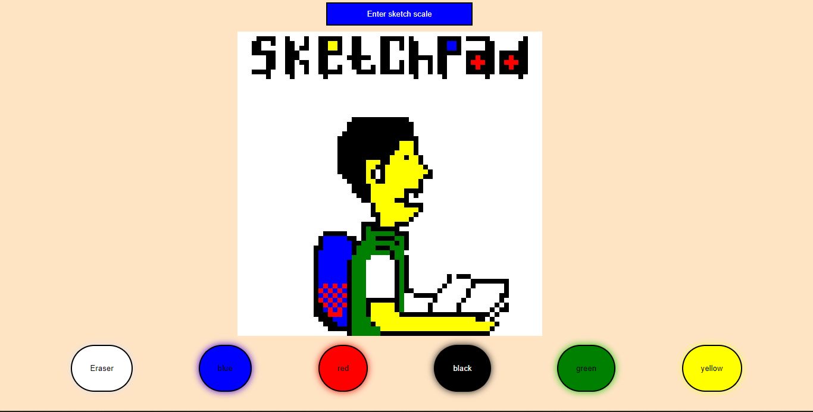
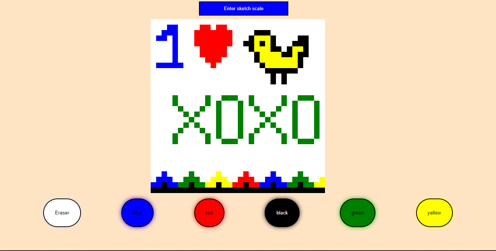

# my-sketchpad

something between sketchpad and etch-a-sketch
this is a simply modified pixel sketch-pad for drawing different objects and shapes

## built with

### technologies

- html
- css
- javascript

### tools

- visual studio code</li>
- git and github

### Demo

Visit the link to view the site
[here](https://primejudas.github.io/my-sketchpad/)
